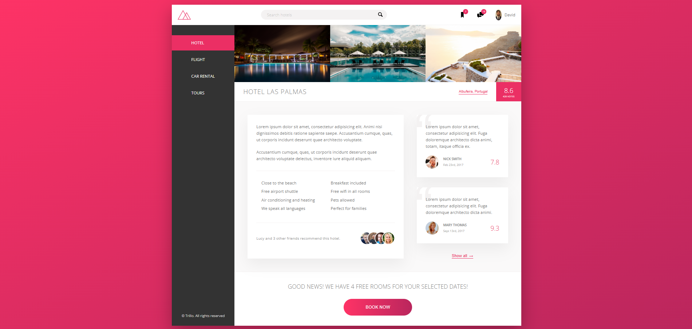

## Overview

This project was meant to practice the HTML and CSS skills and features, allowing me to understand how to accomplish different animations and features that professional webpages have.
The project is a homepage example with different sections based on an hotel booking, built on SASS with no Javascript, meant only for aesthetics and visual effects only.

## Features

Some of the features include:

- Fully responsive design
- Smooth CSS animations
- SCSS variables and mixins
- Modern, clean layout

## Technologies

- HTML5
- SCSS (compiled to CSS)

## Screenshots

## License

For personal/educational use only.
